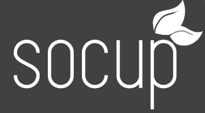
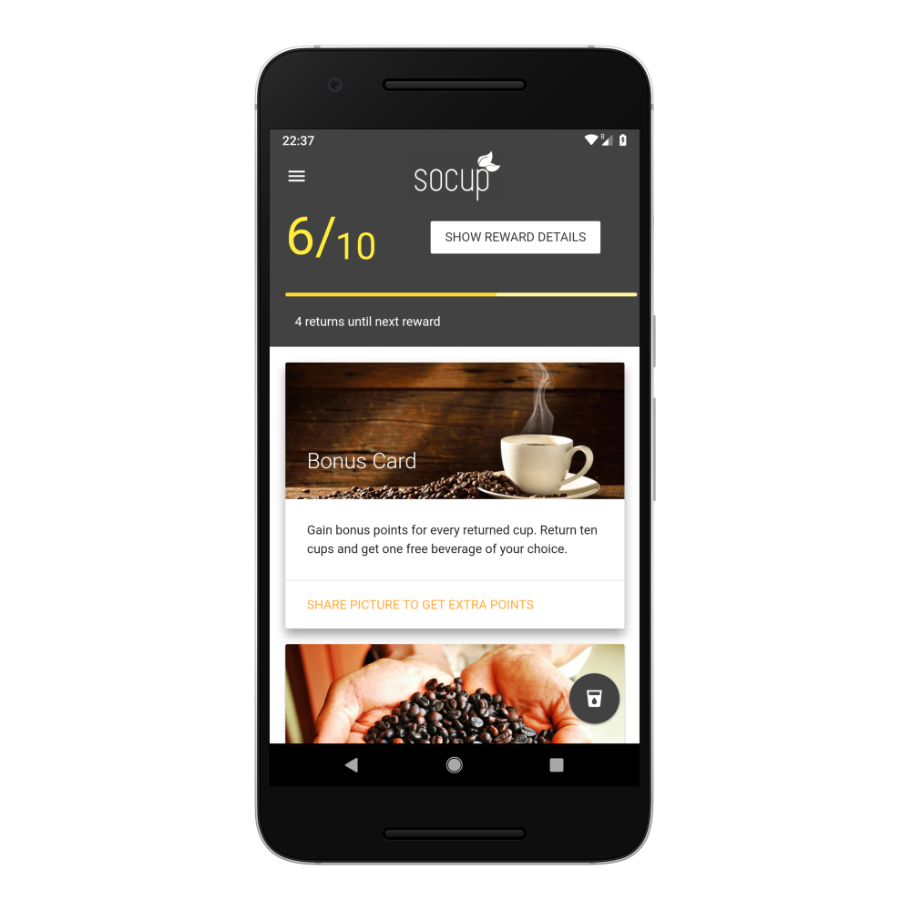

# Eco-friendly Coffee Convenience

> Using RFID to get a refund easily. Throw your cup away - like its one-way.

## How it works

1. Every reusable cup contains a unique ID, machine-readable via RFID/NFC
2. Cup and customer are paired 
   1. through customer card at POS
   2. manually via end-user app (screenshot above)
3. Enjoy coffee
4. Throw the cup into any of the coffee cup bins along the train platform (it is scanned afterwards)

## What it does

1. Saves lots of valuable material
2. Keeps train stations clean
3. Provides customer payback programs
4. Generates unique insights for SBB and coffee vendors

## Future

1. Fastlane for reusable cups
2. Social Media Reach: Share photo to get points
3. Unclaimed cups for charity
4. Many, many more

## Techstack

- RFID-augmented Cups
- Hybrid App (Apache Cordova)
- React Dashboard 
- Python Backend
- Google Firebase and Push Messaging
